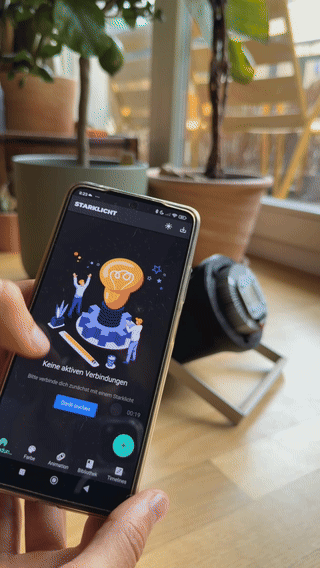

# Starklicht Controller User Guide

Welcome to the Starklicht Controller app! This guide will walk you through the features and functionality of the app, helping you to get the most out of your Starklicht lamp.

## 1. Getting Started

### 1.1. Installation

The Starklicht Controller app is buildeable on Android and iOS because it is written in Flutter. It can also be built on Linux and Max and Windows, but the Bluetooth doesn't work there yet.

### 1.2. Connecting to Your Lamp

Before you can control your Starklicht lamp, you need to connect it to the app via Bluetooth.

1.  **Turn on your Starklicht lamp.**
2.  **Enable Bluetooth on your device.**
3.  **Open the Starklicht Controller app.**
4.  **Navigate to the "Connections" tab.**
5.  **Tap the "+" button to search for nearby Starklicht lamps.**
6.  **Tap on your lamp from the list to connect.**

> **_NOTE:_**  Bluetooth Low Energy Protocol requires to access Location. Without Location, you cannot connect to the Starklicht.

Once connected, you will see a confirmation message, and you can start controlling your lamp.

## 2. App Features

### 2.1. Connections

The "Connections" tab is where you manage your connected Starklicht lamps.

*   **Device List:** This list shows all the Starklicht lamps that are currently connected to the app.
*   **Device Options:** For each device, you can configure the following options:
    *   **Rename:** Give your lamp a custom name for easy identification.
    *   **Invert Colors:** Invert the colors of the lamp's output.
    *   **Delay:** Add a delay to the lamp's response time.
    *   **Activate/Deactivate:** Temporarily disable a lamp without disconnecting it.
    *   **Lamp Groups:** Assign a lamp to a group to control multiple lamps at once.
*   **Disconnect:** Disconnect a lamp from the app.

### 2.2. Color Picker

The "Color" tab allows you to set the color of your Starklicht lamp instantly.

*   **Color Wheel:** Select a color from the color wheel for precise control.
*   **Saved Colors:** Save your favorite colors for quick access.
*   **Random Color:** Generate a random color.
*   **Smooth Transitions:** Create smooth transitions between colors by enabling the "Smooth Transitions" option. You can also set the duration of the transition.
*   **Save/Delete Colors:** You can save the currently selected color to your saved colors list, or delete a color from the list.

### 2.3. Animation Editor

The "Animation" tab is where you can create custom color animations.

*   **Timeline:** The timeline allows you to add, edit, and arrange color keyframes. You can tap on the timeline to add a new keyframe, and drag the keyframes to change their position.
*   **Color Keyframes:** Each keyframe represents a color at a specific point in time. You can tap on a keyframe to change its color.
*   **Animation Settings:**
    *   **Interpolation:** Choose between linear and constant interpolation.
    *   **Time Factor:** Choose how the animation should repeat (loop, ping-pong, shuffle, or once).
    *   **Duration:** Set the duration of the animation.
*   **Animation Preview:** See a live preview of your animation.
*   **Send to Lamp:** Send the animation to your Starklicht lamp.
*   **Save Animation:** Save your animation to the library for later use.

### 2.4. Animation Library

The "Animation Library" is where you can find all your saved animations.

*   **Search:** Search for a specific animation by name.
*   **Animation List:** This list shows all your saved animations. You can tap on an animation to send it to your lamp.
*   **Edit Animation:** Long-press on an animation to open the context menu, where you can edit, rename, or delete the animation.

### 2.5. Timeline Orchestration

❗️ This feature development is in progress!

The "Timeline" tab allows you to sequence complex lighting events.

*   **Timeline Editor:** The timeline editor allows you to add, edit, and arrange animation nodes.
*   **Animation Nodes:** Each node represents an animation from your library. You can tap on a node to change its settings.
*   **Play Timeline:** Play the entire timeline to see your orchestrated lighting scene.
*   **Save Timeline:** Save your timeline for later use.

## 3. Troubleshooting

### 3.1. Connection Issues

If you are having trouble connecting to your Starklicht lamp, try the following:

*   **Check if your lamp is turned on.**
*   **Make sure Bluetooth is enabled on your device.**
*   **Move your device closer to the lamp.**
*   **Restart the app and your lamp.**

### 3.2. App Crashes

If the app crashes, please report the issue to us through the app's feedback feature or by contacting our support team.

## 4. Contact Us

If you have any questions, feedback, or issues, please contact us at:

*   **Website:** [starklicht.net](https://starklicht.net/)
*   **Email:** support@starklicht.net